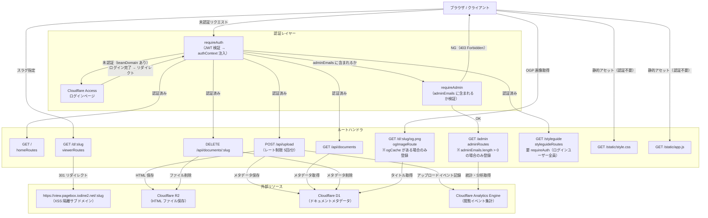

# pagebox 画面遷移・ルート一覧

このファイルは pagebox の画面遷移とルートを一望するための文書です。
**正の情報源は `src/http/app.ts` のルート定義**です。本文書の記述と実装に差異がある場合は、コードを優先してください。

---

## ルート／遷移図

---

## ルート表

| パス | メソッド | ハンドラ関数 | 認証要件 | 概要 | 備考 |
|---|---|---|---|---|---|
| `/static/style.css` | GET | `serveStyle` | なし | CSS スタイルシート配信 | |
| `/static/app.js` | GET | `serveClientJs` | なし | クライアント JS 配信 | |
| `/` | GET | `homeRoutes` → 無名ハンドラ | requireAuth | アップロード UI + ドキュメント一覧 HTML を返す | |
| `/api/upload` | POST | `apiRoutes` → 無名ハンドラ | requireAuth | HTML ファイルをアップロードし、公開 URL（slug）を発行 | レート制限 5回/分（`rateLimiter` が存在する場合） |
| `/api/documents` | GET | `apiRoutes` → 無名ハンドラ | requireAuth | 自グループのドキュメント一覧を JSON で返す | |
| `/api/documents/:slug` | DELETE | `apiRoutes` → 無名ハンドラ | requireAuth | 指定 slug のドキュメントを削除（R2 + D1） | |
| `/d/:slug` | GET | `viewerRoutes` → 無名ハンドラ | なし | `https://view.pagebox.iodine2.net/:slug` へ 301 リダイレクト | XSS 隔離目的でサブドメインに分離 |
| `/d/:slug/og.png` | GET | `ogImageRoute` → 無名ハンドラ | なし | 動的 OGP 画像（PNG）を生成・キャッシュして返す | **`deps.ogCache` が存在する場合のみルート登録される** |
| `/admin` | GET | `adminRoutes` → 無名ハンドラ | requireAuth + requireAdmin | 管理ダッシュボード（分析・ログイン履歴・システム状態） | **`deps.adminEmails.length > 0` の場合のみルート登録される** |
| `/styleguide` | GET | `styleguideRoutes` → 無名ハンドラ | requireAuth | デザインシステムの live リファレンス（トークンのスウォッチ + 全コンポーネント variant） | 常時登録（条件分岐なし） |

### 条件付き登録の詳細

- **`/d/:slug/og.png`**: `createApp` 呼び出し時に `deps.ogCache`（Cloudflare KV バインディング）が渡された場合のみ Hono に登録される。渡されない場合、`/d/:slug` の viewerRoutes だけが有効で、OGP 画像エンドポイントは存在しない。
- **`/admin`**: `deps.adminEmails` の配列長が 1 以上の場合のみ登録される。空配列の場合、管理ルートは一切マウントされない。`adminEmails` は Cloudflare Workers のシークレット（`ADMIN_EMAILS`）から注入される。

---

## 主要ユーザージャーニー

### 1. HTML アップロード → URL 発行

1. ユーザーが `https://pagebox.iodine2.net/` にアクセス。
2. 未認証の場合、`requireAuth` が Cloudflare Access のログインページ（`ACCESS_TEAM_DOMAIN`）へ 302 リダイレクト。
3. ログイン完了後、`/` の HTML（アップロード UI + ドキュメント一覧）が返される。
4. ユーザーが HTML ファイルをドラッグ&ドロップ、またはファイル選択してアップロード。
5. クライアント JS が `POST /api/upload` をマルチパート送信。
6. サーバーが R2 に HTML を保存、D1 にメタデータ（slug・タイトル・サイズ等）を記録し、Analytics Engine にアップロードイベントを記録。
7. レスポンス `{ slug, url, title }` が返り、クライアントが公開 URL を表示。
8. ユーザーが URL をコピー、または「開く」ボタンで閲覧ページへ。

### 2. 一覧からドキュメントを操作

- **開く**: 一覧カードの「開く」ボタン → `GET /d/:slug` → 301 で `view.pagebox.iodine2.net/:slug` へリダイレクト → view サブドメインの Worker が R2 から HTML を配信。
- **URL コピー**: クライアント側で `https://view.pagebox.iodine2.net/:slug` をクリップボードへコピー（サーバー通信なし）。
- **削除**: 「削除」ボタン → `DELETE /api/documents/:slug` → R2 のオブジェクト削除 + D1 のレコード削除 → 一覧を再取得して UI を更新。

### 3. OGP 画像が SNS 等で表示される流れ

1. SNS クローラーが `https://view.pagebox.iodine2.net/:slug` の HTML を取得。
2. HTML の `<meta property="og:image">` が `https://pagebox.iodine2.net/d/:slug/og.png` を指す。
3. クローラーが `GET /d/:slug/og.png` をリクエスト。
4. `ogImageRoute` が KV キャッシュを確認。キャッシュヒット時はキャッシュ済み PNG を返す（`Cache-Control: public, max-age=604800`）。
5. キャッシュミスの場合、D1 からドキュメントタイトルを取得し、SVG を生成して resvg-wasm で PNG にラスタライズ。KV に 7 日間キャッシュして返す。

### 4. 管理者がダッシュボードを閲覧

1. 管理者が `https://pagebox.iodine2.net/admin` にアクセス。
2. `requireAuth` → Cloudflare Access でログイン。
3. `requireAdmin` が `authContext.email` を `adminEmails` 配列と照合。一致しない場合は 403。
4. 一致した場合、以下のデータを並列取得してダッシュボード HTML を返す:
   - **分析データ**: Analytics Engine SQL で過去 30 日の閲覧数（ドキュメント別・国別・リファラー別・合計）。
   - **ログイン履歴**: Cloudflare Access API から直近 50 件のアクセスログ。
   - **システム状態**: Cloudflare GraphQL API から過去 7 日の Worker リクエスト数・エラー数・CPU 時間・D1 クエリ数・R2 使用量。
   - **ストレージ統計**: `adminRepo.getStats()` からユーザー別統計・最近のドキュメント・総件数・総サイズ。
