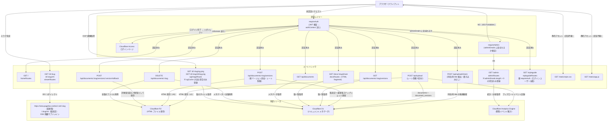

# pagebox 画面遷移・ルート一覧

このファイルは pagebox の画面遷移とルートを一望するための文書です。
**正の情報源は `src/http/app.ts` のルート定義**です。本文書の記述と実装に差異がある場合は、コードを優先してください。

> 以下のホスト名は**本番の値**です。オリジンは環境変数（`APP_ORIGIN` / `VIEW_ORIGIN`）から注入され、
> stage では `stage.pagebox.iodine2.net` / `view.stage.pagebox.iodine2.net` になります。
> URL の組み立ては `src/core/urls.ts` に集約されています（直書き禁止）。環境の詳細は
> [deploy-stage.md](deploy-stage.md)。

---

## ルート／遷移図

```mermaid
flowchart TD
    Browser["ブラウザ / クライアント"]

    subgraph Auth["認証レイヤー"]
        CFAccess["Cloudflare Access\nログインページ"]
        requireAuth["requireAuth\n（JWT 検証 → authContext 注入）"]
        requireAdmin["requireAdmin\n（adminEmails に含まれるか検証）"]
    end

    subgraph Routes["ルートハンドラ"]
        Home["GET /\nhomeRoutes"]
        CheckAPI["POST /api/upload/check\n（同名/同 title 検出・書き込みなし）"]
        UploadAPI["POST /api/upload\n（レート制限 5回/分）"]
        VersionAPI["POST /api/documents/:slug/versions\n（新バージョン追加・レート制限）"]
        RollbackAPI["POST /api/documents/:slug/versions/:version/rollback"]
        VersionsAPI["GET /api/documents/:slug/versions"]
        ShareAPI["GET /docs/:slug/share\ndocsRoutes（HTML fragment）"]
        DocsAPI["GET /api/documents"]
        DeleteAPI["DELETE /api/documents/:slug"]
        Viewer["GET /d/:slug\n/d/:slug/vN\nviewerRoutes"]
        OgImage["GET /d/:slug/og.png\nGET /d/:slug/vN/og.png\nogImageRoute\n※ ogCache がある場合のみ登録"]
        Admin["GET /admin\nadminRoutes\n※ adminEmails.length > 0 の場合のみ登録"]
        Styleguide["GET /styleguide\nstyleguideRoutes\n要 requireAuth（ログインユーザー全員）"]
        StyleCSS["GET /static/style.css"]
        AppJS["GET /static/app.js"]
    end

    subgraph External["外部リソース"]
        ViewSubdomain["https://view.pagebox.iodine2.net/:slug\n（最新版）\n/:slug/vN（版固定）\nXSS 隔離サブドメイン"]
        R2["Cloudflare R2\n（HTML ファイル保存）"]
        D1["Cloudflare D1\n（ドキュメントメタデータ）"]
        CFAE["Cloudflare Analytics Engine\n（閲覧イベント集計）"]
    end

    Browser -->|"未認証リクエスト"| requireAuth
    requireAuth -->|"未認証（teamDomain あり）"| CFAccess
    CFAccess -->|"ログイン完了 → リダイレクト"| requireAuth
    requireAuth -->|"認証済み"| Home
    requireAuth -->|"認証済み"| CheckAPI
    requireAuth -->|"認証済み"| UploadAPI
    requireAuth -->|"認証済み"| VersionAPI
    requireAuth -->|"認証済み"| RollbackAPI
    requireAuth -->|"認証済み"| VersionsAPI
    requireAuth -->|"認証済み"| ShareAPI
    requireAuth -->|"認証済み"| DocsAPI
    requireAuth -->|"認証済み"| DeleteAPI
    requireAuth -->|"認証済み"| Styleguide
    requireAuth -->|"adminEmails に含まれるか"| requireAdmin
    requireAdmin -->|"OK"| Admin
    requireAdmin -->|"NG（403 Forbidden）"| Browser

    Browser -->|"静的アセット（認証不要）"| StyleCSS
    Browser -->|"静的アセット（認証不要）"| AppJS
    Browser -->|"スラグ指定"| Viewer
    Browser -->|"OGP 画像取得"| OgImage

    Viewer -->|"301 リダイレクト"| ViewSubdomain
    CheckAPI -->|"同名/同 title の候補検索"| D1
    UploadAPI -->|"HTML 保存（v1）"| R2
    UploadAPI -->|"documents + document_versions"| D1
    UploadAPI -->|"アップロードイベント記録"| CFAE
    VersionAPI -->|"HTML 保存（vN）"| R2
    VersionAPI -->|"版追記 + 最新版スナップショット更新"| D1
    RollbackAPI -->|"対象版を読んで新版として保存"| R2
    VersionsAPI -->|"版一覧取得"| D1
    ShareAPI -->|"版一覧取得"| D1
    DocsAPI -->|"メタデータ取得"| D1
    DeleteAPI -->|"全版のファイル削除"| R2
    DeleteAPI -->|"メタデータ + 全版削除"| D1
    OgImage -->|"版のタイトル取得"| D1
    Admin -->|"統計・分析取得"| CFAE
```

---

## ルート表

| パス | メソッド | ハンドラ関数 | 認証要件 | 概要 | 備考 |
|---|---|---|---|---|---|
| `/static/style.css` | GET | `serveStyle` | なし | CSS スタイルシート配信 | |
| `/static/app.js` | GET | `serveClientJs` | なし | クライアント JS 配信 | |
| `/` | GET | `homeRoutes` → 無名ハンドラ | requireAuth | アップロード UI + ドキュメント一覧 HTML を返す | |
| `/api/upload/check` | POST | `apiRoutes` → 無名ハンドラ | requireAuth | 同名 / 同 title の既存ドキュメントを探し、選択肢の HTML fragment を返す | 書き込みなし・ファイル本体を受け取らない（先頭 4KB のテキストのみ）ためレート制限の対象外 |
| `/api/upload` | POST | `apiRoutes` → 無名ハンドラ | requireAuth | HTML ファイルを**新規ドキュメント**としてアップロードし、公開 URL（slug）を発行 | レート制限 5回/分（`rateLimiter` が存在する場合） |
| `/api/documents/:slug/versions` | POST | `apiRoutes` → 無名ハンドラ | requireAuth | 既存ドキュメントに**新しいバージョンを追記**する（共有 URL は変わらない） | レート制限 5回/分。他グループの slug は 404 |
| `/api/documents/:slug/versions` | GET | `apiRoutes` → 無名ハンドラ | requireAuth | バージョン一覧を JSON で返す（新しい順） | |
| `/api/documents/:slug/versions/:version/rollback` | POST | `apiRoutes` → 無名ハンドラ | requireAuth | 指定した版の中身を複製して新しい最新版として公開（append-only） | 過去の版は消えない |
| `/docs/:slug/share` | GET | `docsRoutes` → 無名ハンドラ | requireAuth | 共有ポップオーバーの中身を SSR した **HTML fragment** を返す | 一覧 SSR での N+1 を避けるため、ポップオーバーを開いたときだけ取得する |
| `/api/documents` | GET | `apiRoutes` → 無名ハンドラ | requireAuth | 自グループのドキュメント一覧を JSON で返す | 更新の新しい順（`updated_at DESC`） |
| `/api/documents/:slug` | DELETE | `apiRoutes` → 無名ハンドラ | requireAuth | 指定 slug のドキュメントを削除（全版の blob + D1 + OGP キャッシュ） | |
| `/d/:slug` | GET | `viewerRoutes` → 無名ハンドラ | なし | `https://view.pagebox.iodine2.net/:slug` へ 301 リダイレクト | XSS 隔離目的でサブドメインに分離 |
| `/d/:slug/vN` | GET | `viewerRoutes` → 無名ハンドラ | なし | 版固定 URL へ 301 リダイレクト | `N` は 1 以上の整数のみ |
| `/d/:slug/og.png` | GET | `ogImageRoute` → 無名ハンドラ | なし | **最新版**の動的 OGP 画像（PNG）を生成・キャッシュして返す | **`deps.ogCache` が存在する場合のみルート登録される**。キャッシュキーは `{slug}:v{version}` |
| `/d/:slug/vN/og.png` | GET | `ogImageRoute` → 無名ハンドラ | なし | **指定した版**の OGP 画像 | 同上 |
| `/raw/:slug`, `/raw/:slug/vN` | GET | `devViewerRoutes` → 無名ハンドラ | なし | **開発専用**のビューア（ローカルで版別配信を確認するため） | **`PAGEBOX_DEV_VIEWER=1` のときだけ登録される。XSS 隔離を破るので本番では絶対に有効化しない**（`worker.ts` はこのフラグを渡さない） |
| `/admin` | GET | `adminRoutes` → 無名ハンドラ | requireAuth + requireAdmin | 管理ダッシュボード（分析・ログイン履歴・システム状態） | **`deps.adminEmails.length > 0` の場合のみルート登録される** |
| `/styleguide` | GET | `styleguideRoutes` → 無名ハンドラ | requireAuth | デザインシステムの live リファレンス（トークンのスウォッチ + 全コンポーネント variant） | 常時登録（条件分岐なし） |

### 条件付き登録の詳細

- **`/d/:slug/og.png`**: `createApp` 呼び出し時に `deps.ogCache`（Cloudflare KV バインディング）が渡された場合のみ Hono に登録される。渡されない場合、`/d/:slug` の viewerRoutes だけが有効で、OGP 画像エンドポイントは存在しない。
- **`/admin`**: `deps.adminEmails` の配列長が 1 以上の場合のみ登録される。空配列の場合、管理ルートは一切マウントされない。`adminEmails` は Cloudflare Workers のシークレット（`ADMIN_EMAILS`）から注入される。
- **`/raw/:slug`**: `deps.devViewer` が true の場合のみ登録される。これを立てるのは `container.ts`（Bun 経路）が `PAGEBOX_DEV_VIEWER=1` を見たときだけで、`entries/worker.ts` は常に渡さない。メインドメインでユーザー HTML を配信することは view サブドメイン分離（XSS 隔離）を破るため、本番で有効化してはならない。

---

## 主要ユーザージャーニー

### 1. HTML アップロード → URL 発行

1. ユーザーが `https://pagebox.iodine2.net/` にアクセス。
2. 未認証の場合、`requireAuth` が Cloudflare Access のログインページ（`ACCESS_TEAM_DOMAIN`）へ 302 リダイレクト。
3. ログイン完了後、`/` の HTML（アップロード UI + ドキュメント一覧）が返される。
4. ユーザーが HTML ファイルをドラッグ&ドロップ、またはファイル選択してアップロード。
5. クライアント JS がまず `POST /api/upload/check` に `{ fileName, headSnippet }`（先頭 4KB のテキスト）を送る。
6. サーバーが `deriveTitle` で title を推定し、同じ `original_name` または同じ `title` の既存ドキュメントを検索。
   - **候補あり** → 選択肢の HTML fragment（`UpdateChoices`）を返し、クライアントがダイアログで「既存の v(N+1) として更新」か「別のドキュメントとして新規公開」を選ばせる。
   - **候補なし** → そのまま新規として進む。
7. 新規なら `POST /api/upload`、更新なら `POST /api/documents/:slug/versions` をマルチパート送信。
8. サーバーが R2 に HTML を保存（キーは `{slug}-v{N}.html`）、D1 の `documents`（最新版のスナップショット）と `document_versions`（履歴）を更新し、Analytics Engine にアップロードイベントを記録。
9. レスポンス `{ slug, url, title, version }` が返り、クライアントが公開 URL と「vN を公開しました」を表示（メッセージは sessionStorage 経由でリロード後も残る）。
10. **共有 URL は常に最新版を配信するので、更新しても貼り直しは不要。**

### 2. 一覧からドキュメントを操作

- **開く**: 一覧カードの「開く」ボタン → `view.pagebox.iodine2.net/:slug`（常に最新版）→ view サブドメインの Worker が R2 から HTML を配信。
- **共有 / バージョン履歴**: 「共有」ボタン → `GET /docs/:slug/share` の fragment をカード直下のポップオーバーに差し込む。Claude Code の artifact ページヘッダーにある Share メニュー相当。中身は共有 URL + コピー、および「バージョン N を共有中（最新）」と版一覧。
  - 各版の**開く**: 最新版は `/:slug`、過去版は `/:slug/vN` の固定 URL。
  - 各版の **URLコピー**: 版固定 URL をクリップボードへ（最新版は上部の共有 URL と同じなので重複させない）。
  - **この版に戻す**: `POST /api/documents/:slug/versions/:version/rollback` → その版の中身を複製して新しい最新版として公開（append-only なので過去の版は消えず、戻した操作も履歴に残る）。
- **削除**: 「削除」ボタン → `DELETE /api/documents/:slug` → 全版の blob 削除 + D1 のレコード削除 + 版ごとの OGP キャッシュ掃除 → カードを DOM から除去。

### 3. OGP 画像が SNS 等で表示される流れ

1. SNS クローラーが `https://view.pagebox.iodine2.net/:slug`（または `/:slug/vN`）の HTML を取得。
2. HTML の `<meta property="og:image">` が `https://pagebox.iodine2.net/d/:slug/og.png`（版固定なら `/d/:slug/vN/og.png`）を指す。タイトル・説明文は**閲覧している版**のもの。
3. クローラーが OGP 画像をリクエスト。
4. `ogImageRoute` はまず対象の版を解決し（未指定なら `documents.latest_version`）、`{slug}:v{version}` のキーで KV キャッシュを確認する。ヒット時はキャッシュ済み PNG を返す（`Cache-Control: public, max-age=604800`）。
5. キャッシュミスの場合、その版のタイトルから SVG を生成して resvg-wasm で PNG にラスタライズ。KV に 7 日間キャッシュして返す。

> キーを版ごとに分けているため、ドキュメントを更新しても古いタイトルの画像が返ることはない。

### 4. 管理者がダッシュボードを閲覧

1. 管理者が `https://pagebox.iodine2.net/admin` にアクセス。
2. `requireAuth` → Cloudflare Access でログイン。
3. `requireAdmin` が `authContext.email` を `adminEmails` 配列と照合。一致しない場合は 403。
4. 一致した場合、以下のデータを並列取得してダッシュボード HTML を返す:
   - **分析データ**: Analytics Engine SQL で過去 30 日の閲覧数（ドキュメント別・国別・リファラー別・合計）。
   - **ログイン履歴**: Cloudflare Access API から直近 50 件のアクセスログ。
   - **システム状態**: Cloudflare GraphQL API から過去 7 日の Worker リクエスト数・エラー数・CPU 時間・D1 クエリ数・R2 使用量。
   - **ストレージ統計**: `adminRepo.getStats()` からユーザー別統計・最近のドキュメント・総件数・**総バージョン数**・総サイズ。サイズ系は `document_versions` 基準（バージョンは無制限に保持するため、最新版だけの合計では実際の R2 使用量から乖離する）。
